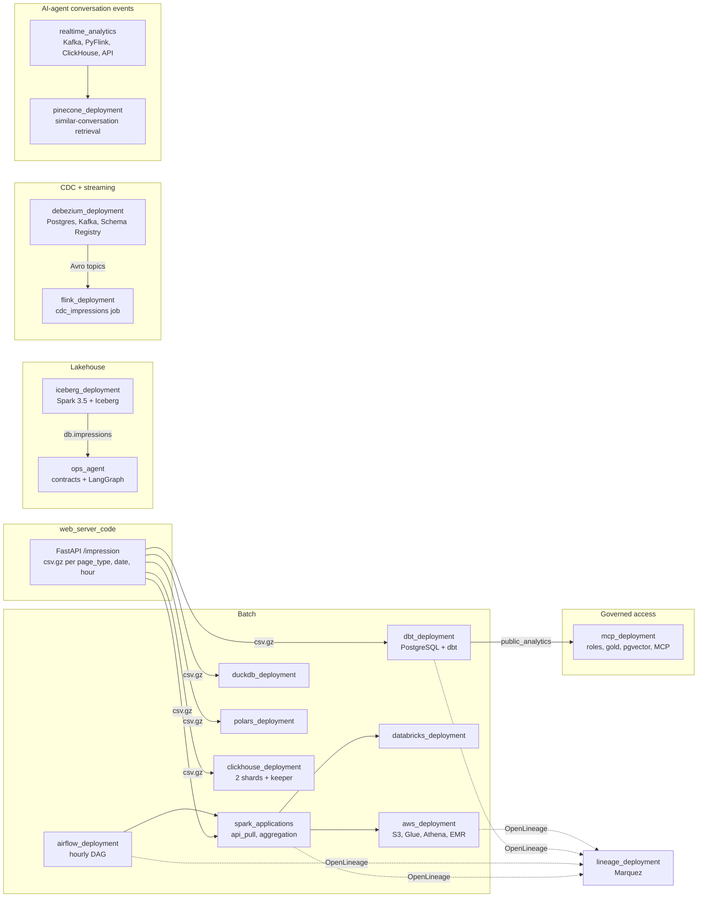

# data_processing

A multi-platform data engineering repository: the same simulated event data,
processed through batch, streaming, CDC, and OLAP stacks, each deployable
locally with Docker and (where relevant) to AWS or Databricks.

---

## Featured: real-time analytics with ClickHouse and Flink

**[`realtime_analytics/`](realtime_analytics/) — Kafka → PyFlink → ClickHouse
pipeline for AI agent conversation events, with a documented ClickHouse tuning
journey taking the tenant dashboard query from 181 ms to 2.4 ms (75×) and the
platform-wide query from 286 ms to 2.0 ms (143×) — reading 91 rows instead of
12,000,000 — and a FastAPI service serving every endpoint at a p95 of 1.2 ms
against a 100 ms target.**

Every number is produced by a benchmark script in the repo, verified to return
identical results at every stage, and reproducible on a laptop with no server
required. The writeup covers what did **not** work as much as what did:
a skipping index that pruned nothing, an aggregate projection the planner never
selected, a materialized view that was slower than the scan it replaced until
its index granularity was fixed, and a partitioning scheme the measurements
forced a rewrite of.

→ **[Read the tuning writeup](realtime_analytics/README.md)** ·
**[How each optimization works](realtime_analytics/OPTIMIZATIONS.md)**

---

## Featured: governed agent access to the gold layer

**[`mcp_deployment/`](mcp_deployment/) — an MCP server that lets an LLM agent
find what exists in the gold datamart and run a pre-approved, parameterized
query against it, and structurally nothing else: the server has no tool that
accepts SQL, and the PostgreSQL role it connects as can `SELECT` gold and the
catalog only. Underneath: least-privilege roles per pipeline stage, a
blue-green promotion into `gold` done by one `SECURITY DEFINER` function with a
release log and a tested rollback, and a pgvector catalog of every gold table,
column and template generated from the dbt manifest.**

Measured rather than asserted: the hashing embedder finds the right template
38 % of the time on paraphrased questions against 88 % for MiniLM; a catalog of
10,000 templates searches in 0.7 ms once the planner uses the HNSW index, and
the first run showed why it did not; a connection pool takes the server from
491 to 3,639 calls per second at eight concurrent callers. Verified end to end
against PostgreSQL in Docker, and driven over stdio by a raw JSON-RPC client,
which found the one bug the tests had not.

→ **[Read the writeup](mcp_deployment/README.md)** ·
**[The measurements](mcp_deployment/README.md#measured-2026-09-23)**

---

## Featured: a contracts-driven ops agent over Iceberg

**[`ops_agent/`](ops_agent/) — a rules-first LangGraph agent that watches the
Iceberg impression tables against YAML data contracts: schema drift, enum
drift, volume collapse, staleness, monitor breaches and arrival gaps. It reads
Iceberg metadata, not data, and pairs renames by field ID, so a renamed column
is one `renaming` finding rather than a phantom drop plus a phantom add.
Findings are persisted, actionable ones become incident files, and a daily
report diffs the platform day over day without recomputing a number.**

The recorded demo evolves the schema three ways and lands a collapsed batch
carrying an unregistered event stage; the agent classifies the seven findings
it raises as `widening`, `renaming`, `additive`, `enum_drift` and three
`breaking`, and the report explains each. 72 tests, five of them on real
Iceberg tables; the two-engine test design caught a Spark-versus-DuckDB
decimal difference before it reached production.

→ **[Read the writeup](ops_agent/README.md)** ·
**[The demo, as it ran](ops_agent/README.md#the-demo-as-it-ran-2026-09-22)**

---

## Architecture

One simulated impression event source feeds most of the modules; each pulls or
generates its own copy and deploys on its own. A second event model, AI-agent
conversation events, drives the real-time path on the right.

- Iceberg and the Debezium source database generate their own copies of the
  same impression model rather than pulling from the API.
- Dashed edges are opt-in and gated on one variable, `OPENLINEAGE_URL`.
- Every module in the table below has its own `## Architecture` diagram.

## Modules

| Directory | What it is |
| --- | --- |
| [`realtime_analytics/`](realtime_analytics/) | **Kafka + PyFlink + ClickHouse** real-time analytics for AI agent conversation events, with a measured schema-tuning writeup and a sub-100 ms FastAPI serving layer |
| [`spark_applications/`](spark_applications/) | PySpark jobs: API ingestion with transactional raw landing and manifests, volume/anomaly checks, partitioned writes, aggregation with a broadcast-first / salted hot-key join, seven worked debugging cases, plus `DECISIONS.md` and `DEBUGGING.md` |
| [`flink_applications/`](flink_applications/) | PyFlink jobs, including a Debezium CDC consumer (Avro via Schema Registry, exactly-once, event-time watermarks) writing to an upsert-kafka sink |
| [`airflow_deployment/`](airflow_deployment/) | Airflow 2 via Docker: backfillable hourly DAG, dynamic task mapping, Dataset-triggered freshness/volume checks, OpenLineage provider, and a reprocessing `RUNBOOK.md` |
| [`aws_deployment/`](aws_deployment/) | CloudFormation: EMR (Spot + managed scaling), S3 lifecycle tiers, Lambda, Step Functions, Glue 5.0, Athena workgroup with a scanned-bytes cutoff, DynamoDB; cost narrative in `FINOPS.md` |
| [`databricks_deployment/`](databricks_deployment/) | Databricks workflow configuration and deployment script |
| [`local_spark_deployment/`](local_spark_deployment/) | Local Spark cluster wired to the Airflow deployment |
| [`flink_deployment/`](flink_deployment/) | Local Flink JobManager/TaskManager cluster |
| [`debezium_deployment/`](debezium_deployment/) | Postgres → Debezium → Kafka CDC stack with Confluent Schema Registry (BACKWARD compatibility) and a measured `ALTER TABLE` walkthrough in `SCHEMA_EVOLUTION.md` |
| [`dbt_deployment/`](dbt_deployment/) | dbt + PostgreSQL: staging, intermediate, and four analytical models with enforced contracts, tests, and source freshness |
| [`clickhouse_deployment/`](clickhouse_deployment/) | Distributed ClickHouse: 2 shards + keeper, Distributed over ReplicatedMergeTree |
| [`iceberg_deployment/`](iceberg_deployment/) | **Apache Iceberg** lakehouse tables on Spark 3.5: field-ID schema evolution, partition evolution, time travel and rollback, MERGE upserts, and compaction/expiry maintenance — 22 tests against real tables |
| [`ops_agent/`](ops_agent/) | **Contracts-driven ops agent** over the Iceberg tables: YAML data contracts and feed configs, metadata-only sensors, monitors with persisted median/MAD baselines, arrival SLAs, a rules-first LangGraph agent that classifies schema drift by Iceberg field ID (a rename is one finding), throttled alerts, incidents, and a daily report with a day-over-day diff — 72 tests |
| [`mcp_deployment/`](mcp_deployment/) | **Governed agent access to gold**: least-privilege Postgres roles per stage, blue-green promotion into `gold` with a release log and tested rollback, a pgvector catalog generated from the dbt manifest, pre-approved parameterized query templates, and a FastMCP server whose only tools search the catalog and run templates — no raw-SQL path exists |
| [`duckdb_deployment/`](duckdb_deployment/) | DuckDB as an embedded, application-level OLAP engine behind FastAPI |
| [`polars_deployment/`](polars_deployment/) | **Polars** as a single-node, in-process DataFrame engine: lazy plans over hive-partitioned Parquet, in-memory vs streaming execution, and a verified benchmark against eager reads and DuckDB that says when the Spark job fits on one machine |
| [`pinecone_deployment/`](pinecone_deployment/) | **Pinecone** similar-conversation retrieval for the AI agent events: namespace vs filter tenant isolation, hybrid search, reranking, exact-kNN recall harness, embedding-model migration; measured on Pinecone Local, 20 tests |
| [`lineage_deployment/`](lineage_deployment/) | Marquez (OpenLineage backend + UI) and `LINEAGE.md`, the lineage story across Spark, S3, Glue, Athena and dbt |
| [`web_server_code/`](web_server_code/) | FastAPI service generating the simulated impression data everything else consumes |
| [`web_server_local/`](web_server_local/), [`web_server_aws/`](web_server_aws/) | Local and AWS deployments of that service |

## Conventions

- Python 3.10, PEP 8, dependencies managed with `uv`
- Spark 3.5, Airflow 2.11.1, Flink 1.18.1, Databricks 17.3, Pinecone SDK 7.x, Polars 1.44
- Each module has its own `README.md`, `deploy.sh`, and tests
- Containers share an external Docker network, `data-processing-network`
- Lineage is opt-in everywhere through one variable, `OPENLINEAGE_URL`

See [`Planning.md`](Planning.md) for the layout rationale and
[`Tasks.md`](Tasks.md) for status.
