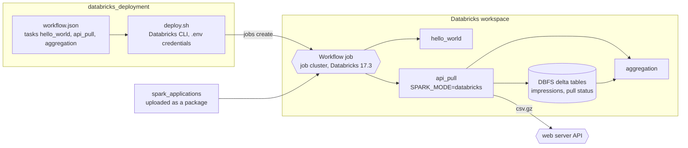

# Databricks Deployment

Deploys Spark application workflows to a Databricks workspace.

## Architecture

How the workflow definition reaches a Databricks workspace and what its tasks run.



- Same Spark jobs as the local and AWS paths; only the storage adapter (delta on DBFS) and the pull-status table change.


- **workflow.json**: Defines a multi-task Databricks workflow (`data_processing_workflow`) with three tasks:
  1. `api_pull` - Pulls impression data from the API and saves to a Delta table
  2. `aggregation` - Aggregates impression data by user_id, impression_id, page_type (depends on `api_pull`)
  3. `hello_world` - Simple validation task
- Uses a job cluster with Databricks Runtime 17.3 (Spark `17.3.x-scala2.12`), 2 worker nodes (`i3.xlarge`)
- Accepts parameters: `page_type`, `date`, `hour`

- **deploy.sh**: Shell script to upload Spark application code to DBFS and manage the workflow job.

## Prerequisites

- Databricks CLI installed and configured
- A `.env` file in the project root with:
  - `DATABRICKS_HOST` - Databricks workspace URL
  - `DATABRICKS_TOKEN` - Databricks personal access token

## How to Deploy

```bash
# Full deployment: upload code + create/update the workflow job
./deploy.sh deploy

# Upload spark application files to DBFS only
./deploy.sh upload-code

# Create a new workflow job
./deploy.sh create-job

# Update an existing workflow job
./deploy.sh update-job

# Check workflow job status
./deploy.sh status

# Delete the workflow job
./deploy.sh delete-job
```

The deploy script uploads all Python files from `spark_applications/spark_applications/` (including the `utils/` package) to `dbfs:/spark_applications/spark_applications/`.
