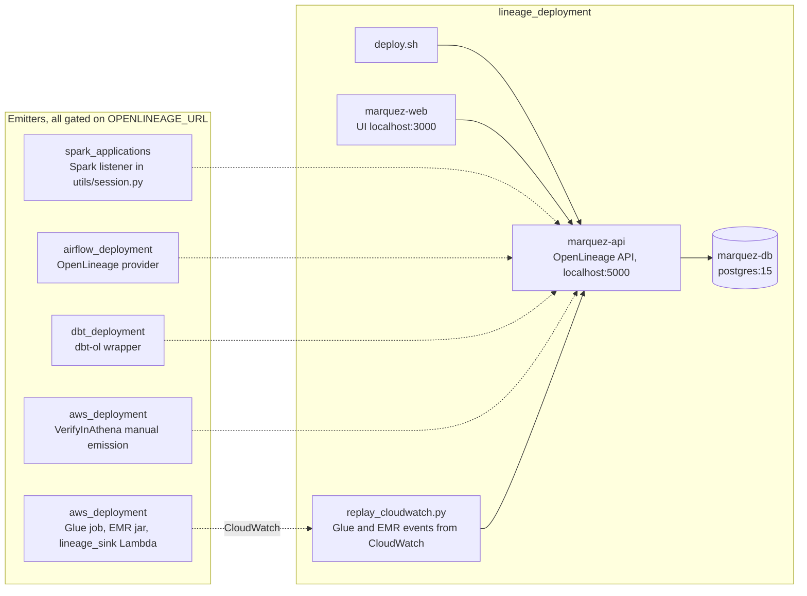

# Lineage Deployment (Marquez)

Runs [Marquez](https://marquezproject.ai), the OpenLineage reference backend,
so the pipelines in this repo can report what they read and wrote. Three
containers: `marquez-api` (the `POST /api/v1/lineage` endpoint on port 5000),
`marquez-web` (graph UI on port 3000) and a PostgreSQL.

```bash
./deploy.sh up            # shared data-processing-network (Airflow, Spark, dbt reach http://marquez-api:5000)
./deploy.sh up local      # standalone network
./deploy.sh smoke         # posts a synthetic START/COMPLETE run; proves the endpoint
./deploy.sh namespaces    # what has reported in
./deploy.sh jobs          # jobs in the data_processing namespace
./deploy.sh down
```

Nothing emits until it is told to. Every emitter in the repo keys off one
variable, `OPENLINEAGE_URL` (plus `OPENLINEAGE_NAMESPACE`, default
`data_processing`); unset, they run exactly as before. How each layer emits
and what the resulting graph looks like is in `LINEAGE.md`.


## Architecture

Marquez as the OpenLineage backend, and every emitter in the repository that can point at it.



- `LINEAGE.md` describes each emitter and what was verified live; the Glue and EMR path was replayed into local Marquez from the stack's capture endpoint.
