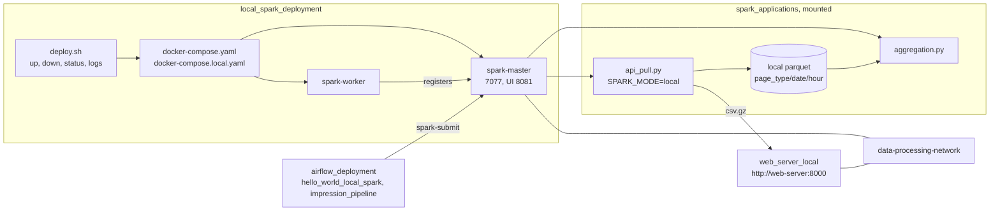

# Local Spark Deployment

Deploys a local Apache Spark 3.5 cluster using Docker with a master and worker node.

## Architecture

A two-container Spark standalone cluster that Airflow submits to and that reads the web server over the shared network.



- `docker-compose.local.yaml` runs the cluster standalone when Airflow is not up; the shared network is what lets Airflow's containers resolve `spark-master`.


- **Dockerfile**: Builds on the official `spark:3.5.7-scala2.12-java17-ubuntu` image with Python 3 pip installed.
- **docker-compose.yaml**: Runs two services:
  - `spark-master` - Spark master node (port 7077 for Spark, port 8081 for web UI)
  - `spark-worker` - Spark worker node (2 cores, 2GB memory)
- Both containers mount `../spark_applications/spark_applications` to `/opt/spark-apps` for access to Spark job scripts.

## Prerequisites

- Docker and Docker Compose
- By default, the `data-processing-network` Docker network must exist (created by running `airflow_deployment/deploy.sh up` first)
- Pass `local` to run standalone without the shared network

## How to Run

```bash
# Start the Spark cluster (requires data-processing-network)
./deploy.sh up

# Start the Spark cluster in standalone mode (no Airflow dependency)
./deploy.sh up local

# Stop the cluster
./deploy.sh down

# Restart the cluster
./deploy.sh restart

# Standalone variants work with all commands
./deploy.sh down local
./deploy.sh restart local
./deploy.sh status local
./deploy.sh logs local
```

Once running, access the Spark master UI at http://localhost:8081.

## Submitting Applications

Once the cluster is running, you can submit Spark applications using `docker exec` on the master container.

### Submit a Python application

```bash
# Submit a PySpark script that is mounted in /opt/spark-apps
docker exec spark-master /opt/spark/bin/spark-submit \
  --master spark://spark-master:7077 \
  /opt/spark-apps/my_job.py
```

### Submit with custom configuration

```bash
docker exec spark-master /opt/spark/bin/spark-submit \
  --master spark://spark-master:7077 \
  --executor-memory 1g \
  --total-executor-cores 2 \
  /opt/spark-apps/my_job.py
```

### Submit a JAR application

```bash
docker exec spark-master /opt/spark/bin/spark-submit \
  --master spark://spark-master:7077 \
  --class com.example.MainClass \
  /opt/spark-apps/my_app.jar
```

### Run an interactive PySpark shell

```bash
docker exec -it spark-master /opt/spark/bin/pyspark \
  --master spark://spark-master:7077
```

### Notes

- Place your application files in `../spark_applications/spark_applications/` on the host — they are mounted to `/opt/spark-apps` inside both master and worker containers.
- Monitor job progress via the Spark master UI at http://localhost:8081.
- To pass additional files or packages, use the `--py-files` or `--packages` flags with `spark-submit`.

## Network

By default, connects to the shared `data-processing-network` Docker network, allowing Airflow to submit Spark jobs via `spark://spark-master:7077`.

When launched with `local`, uses an isolated `spark-local-network` instead, so no external network dependency is required.
