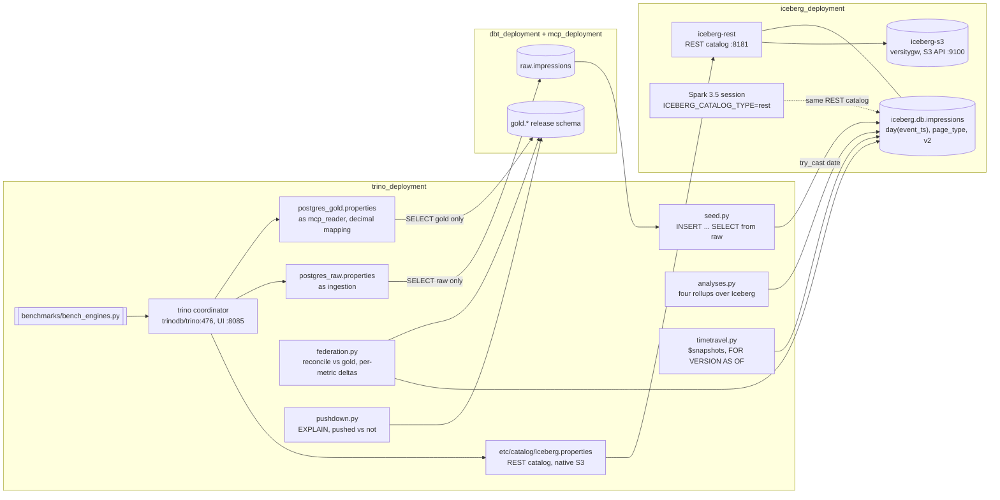

# Trino — one SQL engine over the lakehouse and the warehouse

Trino as a federated query engine over the stores this repository already
runs: the **Iceberg REST catalog** that [`../iceberg_deployment`](../iceberg_deployment/)
writes to, and the **dbt PostgreSQL** from [`../dbt_deployment`](../dbt_deployment/),
mounted twice through the stage roles that [`../mcp_deployment`](../mcp_deployment/)
defines. The demonstrations are the ones federation exists for:

- **Load the lakehouse from the warehouse in one statement.** `INSERT INTO
  iceberg.db.impressions SELECT ... FROM postgres_raw.raw.impressions`, with
  the same timestamp derivation and the same malformed-date rule as dbt's
  staging model.
- **Reconcile two engines in one query.** The four analyses, computed by Trino
  over Iceberg, joined against dbt's gold tables in PostgreSQL, every metric
  side by side with its delta. Three page types, eleven metrics, zero
  mismatches.
- **Least privilege survives federation.** The gold catalog cannot read raw,
  the raw catalog cannot read gold; PostgreSQL's permission error comes back
  through Trino unchanged.
- **Time travel** through Trino's Iceberg syntax on the same snapshots Spark
  sees, and a **cross-engine check**: Spark reads the table Trino wrote.
- **Pushdown**, shown in the plan: what the PostgreSQL connector sends to the
  database and what it pulls back to filter itself.

```bash
../dbt_deployment/deploy.sh up && ../mcp_deployment/deploy.sh demo   # PostgreSQL, roles, gold
./deploy.sh up          # Iceberg REST + S3 gateway + Trino, waits until healthy
./deploy.sh demo        # the transcript below
./deploy.sh test        # 5 unit tests always, 7 against the stack when reachable
./deploy.sh cli         # the Trino CLI
```

## Architecture

Three catalogs into one coordinator; the PostgreSQL ones connect as the least-privilege stage roles.



- The dashed edge is the cross-engine check: a Spark session in REST mode reads the table Trino created and sees the same snapshots.
- `postgres_raw` and `postgres_gold` are the same database through two roles from `../mcp_deployment/sql/001_roles.sql`.

---

## The demo, as it ran (2026-09-27)

`./deploy.sh demo` against the running stack, after the dbt deployment had
loaded 3,001 raw events (one with a deliberately malformed date) and
`mcp_deployment` had promoted the dbt models into `gold`.

```console
=== 1. catalogs
  iceberg
  postgres_gold
  postgres_raw
  system

=== 2. seed iceberg.db.impressions from postgres_raw.raw.impressions
  inserted 3000 rows; malformed-date rows skipped by try_cast
  table now holds 3000 rows

=== 3. the four analyses over Iceberg, through Trino
  funnel_analysis: 6 rows, columns ['page_type', 'event_type', 'impressions_at_stage', 'total_impressions'] ...
  page_type_summary: 3 rows, columns ['page_type', 'total_impressions', 'unique_users', 'avg_funnel_depth'] ...
  user_engagement: 50 rows, columns ['user_id', 'total_impressions', 'page_types_visited', 'avg_funnel_depth'] ...
  hourly_traffic: 3 rows, columns ['event_date', 'hour', 'page_type', 'total_impressions'] ...
    [1, 400, 50, 1.0, 1, 0.0]
    [2, 400, 50, 1.0, 1, 0.0]
    [3, 400, 50, 1.0, 1, 0.0]

=== 4. reconcile Trino-over-Iceberg against dbt gold in PostgreSQL, one query
  page_type 1: total_impressions iceberg=400 gold=400, pct_reaching_d iceberg=50.0000 gold=50.00
  page_type 2: total_impressions iceberg=400 gold=400, pct_reaching_d iceberg=50.0000 gold=50.00
  page_type 3: total_impressions iceberg=400 gold=400, pct_reaching_d iceberg=50.0000 gold=50.00
  3 page types x 11 metrics: 0 mismatches

=== 5. least privilege survives federation
  gold role reading raw: denied (TrinoExternalError(type=EXTERNAL, name=JDBC_ERROR, message="ERROR: permission denied for schema ...")
  raw role reading gold: denied (TrinoExternalError(type=EXTERNAL, name=JDBC_ERROR, message="ERROR: permission denied for schema ...")

=== 6. time travel
  snapshots: 12; rows now 3043, rows at previous snapshot 3000 (was 3000)
  after DELETE (merge-on-read, v2): rows 3000, snapshots 13

=== 7. pushdown into PostgreSQL
  pushed      result=1 best-of-5 23.3 ms  plan pushed=True
  not pushed  result=1 best-of-5 29.8 ms  plan pushed=False
```

Reading it:

- **3,000 of 3,001 rows crossed.** The one row whose date does not parse is
  excluded by `try_cast`, which is exactly what dbt's `safe_to_date` does in
  staging. That is why the reconciliation can be exact rather than close.
- **Zero mismatches across 33 cells.** Trino computed `page_type_summary`
  from the Iceberg copy with the same distinct-counting and rounding as the
  dbt model, and every metric equals the promoted gold table. Trino's
  `50.0000` against gold's `50.00` is a scale difference, not a value
  difference; the query compares as doubles.
- **The permission errors are PostgreSQL's**, surfaced through the JDBC
  connector. Nothing in Trino's configuration grants more than the role has.
- **Time travel** counted 3,000 rows at the previous snapshot while the
  current one held 3,043; the row-level `DELETE` that cleaned up landed as a
  merge-on-read delete file and a thirteenth snapshot, not a rewrite.
- **Pushdown**: the plan for `WHERE page_type = 3` is a bare `TableScan`,
  meaning PostgreSQL did both the filter and the count. Wrap the column in a
  `CAST` and a `ScanFilterProject` appears above the scan: every row comes
  back to Trino to be filtered there. Same answer; on a real table a very
  different cost.

**Spark reads what Trino wrote.** With `ICEBERG_CATALOG_TYPE=rest`, the
Spark session from `../iceberg_deployment` opened `local.db.impressions`
through the same REST catalog and reported 3,000 rows and 13 snapshots, the
latest a `delete`. Same table, two engines, one catalog owning the commits.

## Engines, measured

`./deploy.sh bench`: each analysis, best of 7 runs from the client, three
ways. The data is toy-sized, so this measures engine overhead, not throughput.

| analysis | Trino over Iceberg, computed | Trino over PostgreSQL gold, precomputed | native PostgreSQL gold, precomputed |
|---|---|---|---|
| page_type_summary | 295.9 ms (median 435.0) | 22.3 ms (median 23.3) | 0.2 ms (median 0.2) |
| user_engagement | 218.6 ms (median 256.2) | 23.4 ms (median 39.1) | 0.3 ms (median 0.4) |
| hourly_traffic | 110.8 ms (median 122.9) | 21.9 ms (median 25.0) | 0.2 ms (median 0.3) |

- **Trino adds ~20 ms per statement over JDBC** even when the remote does all
  the work: planning, the HTTP round trips, the connector. That is the price
  of federation and it is flat.
- **Computing over Iceberg costs 110 to 300 ms here**: planning, listing
  manifests through the REST catalog, reading Parquet from the S3 gateway,
  and the distinct-heavy aggregations. At 3,000 rows that is all overhead;
  it is the fixed cost the engine amortises when the table is large.
- **Native PostgreSQL is sub-millisecond** because dbt already computed the
  answer. The comparison is not "which engine is faster"; it is "what a
  federated read costs against a precomputed mart", which is what an
  architect deciding where a query should run needs to know.

## Two things the stack taught me

- **MinIO's container images are gone.** Both `minio/minio` and `minio/mc`
  fail to resolve on Docker Hub and on quay.io. The Iceberg stack now runs
  `versity/versitygw`, an S3 gateway over a POSIX directory, with the bucket
  created by the `amazon/aws-cli` image. The REST catalog, Spark and Trino
  only ever spoke S3 to it, so nothing else changed except that there is no
  console.
- **dbt's `round(x, 2)` produces unbounded `numeric`, and the PostgreSQL
  connector hides those columns.** `SHOW COLUMNS` on the gold table came back
  without `avg_funnel_depth` or any `pct_*` column until the catalog set
  `decimal-mapping=allow_overflow` with a default scale of 2 and an explicit
  rounding mode. The failing reconciliation test found it.

## Layout

```
docker-compose.yaml          one coordinator, catalogs mounted from etc/catalog
etc/catalog/                 iceberg (REST + native S3), postgres_raw (ingestion), postgres_gold (mcp_reader)
trino_deployment/
  client.py      DB-API wrapper: query, explain, reachable
  seed.py        create the Iceberg table; fill from postgres_raw or synthetically; truncate
  analyses.py    the four analyses in Trino SQL, dbt semantics and rounding
  federation.py  the reconciliation query and its mismatch report
  timetravel.py  $snapshots, FOR VERSION AS OF, $partitions
  pushdown.py    pushed vs unpushed plans and timings, plan classifier
  demo.py        the transcript above
benchmarks/bench_engines.py  -> benchmarks/results/engines.md
tests/test_sql.py            no stack needed; SQL and the plan classifier
tests/test_trino.py          marked trino; catalogs, seed, analyses, exact reconciliation, RBAC, time travel, pushdown
```

Not done: a ClickHouse catalog over `../clickhouse_deployment` (the connector
exists; the cluster was not running), and Trino as the query engine behind
the MCP server's templates, which would let one template read across both
stores.
