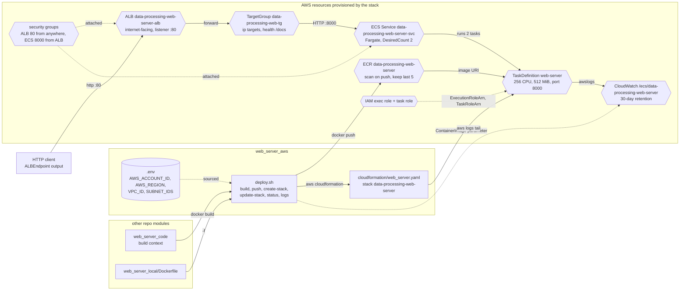

# Web Server AWS

Deploys the FastAPI web server (from `web_server_code`) to AWS using ECS Fargate behind an Application Load Balancer.

## Architecture

The CloudFormation template (`cloudformation/web_server.yaml`) provisions:

- **ECR Repository** - Stores Docker images with scan-on-push and lifecycle policy (keeps last 5 images)
- **ECS Cluster** - Fargate cluster running the web server
- **Task Definition** - Fargate task (256 CPU, 512 MiB memory) with CloudWatch logging
- **ECS Service** - Runs 2 task replicas behind the ALB
- **Application Load Balancer** - Internet-facing ALB on port 80
- **Security Groups** - ALB allows inbound HTTP; ECS tasks only accept traffic from the ALB
- **IAM Roles** - Task execution role and task role
- **CloudWatch Logs** - Log group with 30-day retention


How `deploy.sh deploy` builds the image, pushes it to ECR and creates or updates the stack that `cloudformation/web_server.yaml` defines.



- The image is built from `web_server_code` with `web_server_local/Dockerfile`, so local and AWS run the same container.
- `deploy.sh deploy` chooses `create-stack` or `update-stack` by checking whether the stack already exists; `status` prints the `ALBEndpoint` output.
## Prerequisites

- AWS CLI configured with appropriate credentials
- Docker (for building the container image)
- A `.env` file in the project root with:
  - `AWS_ACCOUNT_ID` - AWS account ID
  - `AWS_REGION` - AWS region
  - `VPC_ID` - VPC ID for ECS and ALB
  - `SUBNET_IDS` - Comma-separated public subnet IDs

## How to Deploy

```bash
# Full deployment: build image, push to ECR, create/update CloudFormation stack
./deploy.sh deploy

# Build the Docker image locally
./deploy.sh build

# Push the image to ECR
./deploy.sh push

# Create the CloudFormation stack
./deploy.sh create-stack

# Update an existing stack
./deploy.sh update-stack

# Check stack status and service URL
./deploy.sh status

# Delete the stack
./deploy.sh delete

# Tail ECS service logs
./deploy.sh logs
```

After deployment, the ALB endpoint URL is available in the CloudFormation stack outputs.
