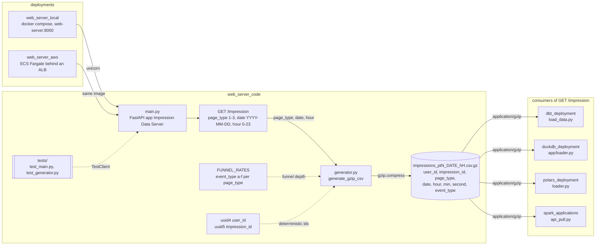

# Web Server Code

FastAPI web server that generates and serves simulated impression data as gzip-compressed CSV files.

## Architecture

The endpoint, the generator behind it, the csv.gz it returns, and the repo modules that fetch it.



- Every impression rolls one random number against `FUNNEL_RATES[page_type]`, so `event_type` `f` only appears when `a` through `e` did; page type 1 never reaches `e`.
- `impression_id` is `uuid5` of `user_id:page_type:date:hour:minute`, so the same user in the same minute never gets two impressions.
- Consumers issue the GET themselves; `airflow_deployment` and `clickhouse_deployment` fetch the same endpoint and are omitted for space.

## API

### `GET /impression`

Generates and returns a gzip CSV file containing impression data.

**Parameters:**
- `page_type` (int, required) - Page type: 1, 2, or 3
- `date` (str, required) - Date in YYYY-MM-DD format
- `hour` (int, required) - Hour: 0-23

**Response:** A gzip-compressed CSV file with the following columns:
- `user_id` - UUID representing user activity (minimum 1,000 unique users per file)
- `impression_id` - UUID, same across user_id/page_type/event_type/date/hour/min combinations
- `page_type` - Enumeration: 1, 2, or 3
- `date`, `hour`, `min`, `second` - Timestamp components
- `event_type` - Enumeration: a, b, c, d, e, f (alphabetical and chronological order)

**Data characteristics:**
- Each file contains 10,000 to 100,000 impressions
- Event types are sequential: event_type `f` only exists if `a` through `e` also occurred for the same impression_id/user_id/page_type/date/hour/min
- Page type 1: ~10% reach event `d`, 0% reach `e` or `f`
- Page type 2: ~30% reach event `d`, ~10% reach `e`, 0% reach `f`
- Page type 3: ~50% reach event `d`, ~20% reach `e`, ~10% reach `f`

## Prerequisites

- Python 3.10+
- uv (Python package manager)

## How to Run Locally (without Docker)

```bash
# Install dependencies
uv sync

# Start the server
uv run uvicorn web_server_code.main:app --host 0.0.0.0 --port 8000

# Access API docs
# http://localhost:8000/docs
```

## Tests

```bash
uv sync --extra dev
uv run pytest
```

## Dependencies

- fastapi
- uvicorn
