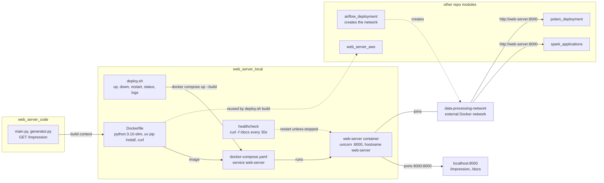

# Web Server Local

Deploys the FastAPI web server (from `web_server_code`) locally using Docker.

## Architecture

- **Dockerfile**: Builds a Python 3.10-slim image, installs uv, copies the web server code, and runs uvicorn on port 8000.
- **docker-compose.yaml**: Runs the web server container, exposing port 8000 with a health check against `/docs`.


How `deploy.sh up` builds `web_server_code` into the `web-server` container and who reaches it on the shared network.



- The build context is `../web_server_code` with this module's `Dockerfile`, so the image is the application code plus uvicorn.
- `data-processing-network` must already exist; `airflow_deployment/deploy.sh up` creates it, and `polars_deployment` and `spark_applications` resolve the server by its `web-server` hostname.
## Prerequisites

- Docker and Docker Compose
- The `data-processing-network` Docker network must exist (created by running `airflow_deployment/deploy.sh up` first)

## How to Run

```bash
# Start the web server
./deploy.sh up

# Stop the web server
./deploy.sh down

# Restart the web server
./deploy.sh restart

# Check service status
./deploy.sh status

# Tail logs
./deploy.sh logs
```

Once running:
- Web server available at http://localhost:8000
- API docs at http://localhost:8000/docs

## Network

Connects to the shared `data-processing-network` Docker network, allowing Spark applications and Airflow to access the web server at `http://web-server:8000`.
